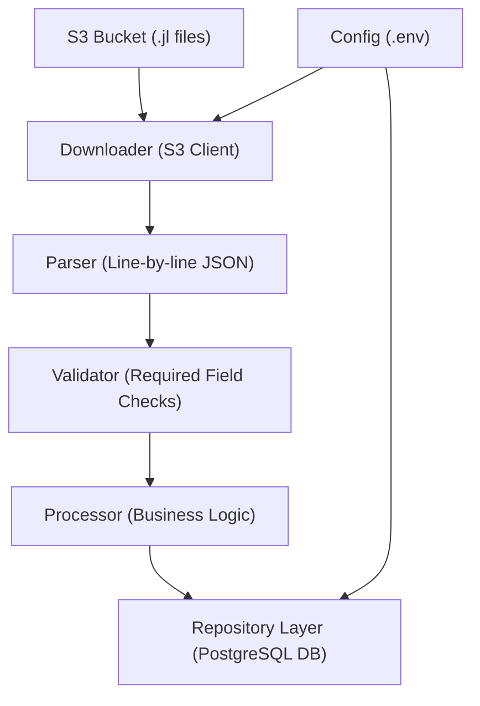

# Review Service Microservice

# # Overview
This microservice ingests hotel review data from an AWS S3 bucket (in .jl format), parses and validates the reviews, and stores them in a PostgreSQL database. The service is designed to be modular, scalable, and easy to extend to support multiple providers and formats.

# # Architecture Diagram


# # Features
- Fetches .jl review files from S3 bucket
- Idempotent processing of only new files
- Line-by-line JSON parsing
- Robust validation of each review
- Logs malformed entries
- Inserts clean data into PostgreSQL
- Dockerized setup with docker-compose
- Modular package structure
- Extendable for new providers and platforms

# # Setup Instructions

# # Prerequisites
- Docker
- AWS credentials (via environment variables or IAM role)
- Go 1.21+ (if running locally)

# # Local Development
- Clone the repository
- Setup environment variables in a .env file (or export manually)
- Run with Docker:
```console
docker-compose up --build
```
- To ingest reviews:
```console
docker exec review-service go run cmd/main.go
```

# # Configuration
Environment variables can be defined in a .env file or passed at runtime.
Sample.env
```
AWS_REGION=ap-southeast-1
AWS_BUCKET_NAME=your-bucket-name
AWS_PREFIX=reviews/
DB_HOST=postgres
DB_PORT=5432
DB_USER=postgres
DB_PASSWORD=postgres
DB_NAME=reviews
```
You may override configuration like this:
```console
DB_PASSWORD=mynewpassword AWS_PREFIX=agoda/ go run cmd/main.go
```

# # Running Tests
Tests are organized by module (parser, validator, db, etc.).
To run all tests:
```console
go test ./...
```

Ensure you have:
- A test PostgreSQL database running (can reuse docker-compose)
- Seed data if needed (under test/)

You can also run specific package tests:
```console
go test ./internal/parser
```

# # Design Decisions

# # Idempotency
- Only new files from S3 (based on file name tracking or metadata) are processed.
- Avoids re-processing previously ingested data.

# # Modularity
- Each major concern is isolated:
        s3/: AWS file fetching
        parser/: Decoding .jl files
        validator/: Ensuring schema compliance
        db/: Persistence logic
- Interfaces allow for easy testing and swapping of implementations.

# # Validation Strategy
- All required fields are validated before DB insertion.
- Malformed records are logged and skipped (no crash).
- Uses custom logic in validator.go, can be extended with a validation library.

# # Folder Structure
```
.
├── cmd/                    # Entry point
├── config/                 # Configuration logic
├── internal/
│   ├── db/                 # Database connection and repository
│   ├── models/             # Data models
│   ├── parser/             # .jl file parsing logic
│   ├── processor/          # Coordination of parsing, validation, and saving
│   ├── s3/                 # AWS S3 client
│   └── validator/          # Review validation logic
├── scripts/                # SQL init scripts
├── test/                   # Sample test data
├── Dockerfile
├── docker-compose.yml
└── README.md
```

# # Future Enhancements
- Add REST API for fetching reviews
- Add streaming support via AWS Lambda + Kinesis
- Implement retry logic and monitoring
- Add concurrency for bulk file processing
- CI/CD pipeline for test and deployment

